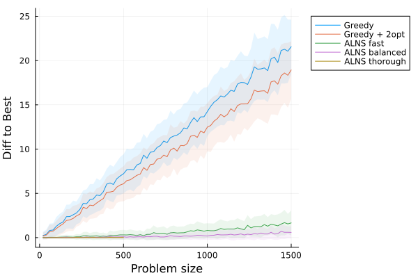
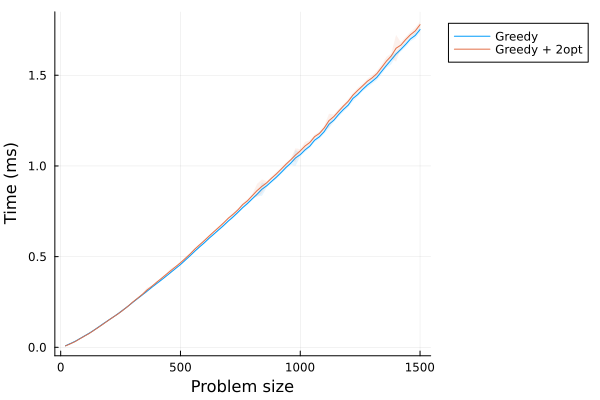
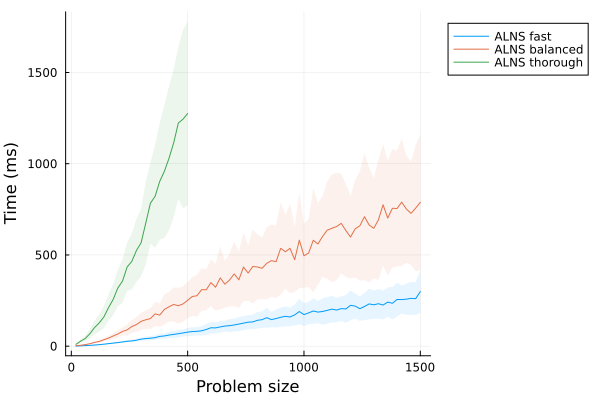
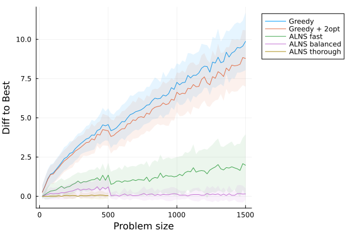
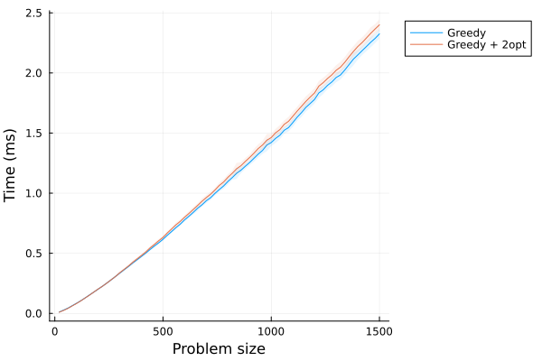
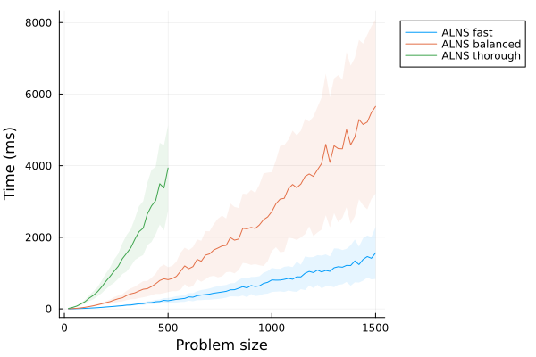

**Teilnahme-ID: 81342**

**Bearbeiter: Raphael Porsche**


---

## Inhaltsverzeichnis

1. Lösungsidee
   1. Problemdefinition und formale Einordnung
   2. NP-Schwerebeweis
   3. Notwendigkeit von Heuristiken
   4. Der Tradeoff zwischen Geschwindigkeit und Qualität
   5. Heuristik 1: Greedy-Ansatz mit Caching und KD-Baum
   6. Heuristik 2: Greedy mit 2-Opt-Verbesserung
   7. Heuristik 3: Adaptive Large Neighborhood Search mit Simulated Annealing
   8. Beispielgeneratoren
   9. Datenstrukturen: Zirkulär doppelt verkettete Liste mit Pool-Allokator
2. Umsetzung
3. Beispiele
4. Quellcode

---

## 1 Lösungsidee

### 1.1 Problemdefinition und formale Einordnung

Gegeben sei eine Menge von Bäumen $T = \{t_1, t_2, \ldots, t_n\}$ mit Positionen $t_i \in \mathbb{R}^2$ und eine Batteriekapazität $B > 0$. Unsere Aufgabe liegt darin, Bewässerungsroboter so zu platzieren, dass ihre Routen mit einer Länge kleiner als $B$ insgesamt alle Bäume abdecken. Da wir das Depot frei legen können, müssen wir uns nur um die Gruppierung der Bäume kümmern. Wir können das Depot des Roboters stets auf einen Baum legen, ohne jemals suboptimal zu sein. So ist eine Menge von Routen gesucht $R = \{r_1, r_2, \ldots, r_k\}$, wobei jede Route $r_j = (t_{j,0}, t_{j,1}, \ldots, t_{j,m_j})$ folgende Bedingung erfüllt:

$$\text{len}(r_j) = \sum_{i=1}^{m_j} d(t_{j,i}, t_{j,i+1}) \leq B$$

wobei $d$ die euklidische Distanz zwischen zwei Punkten bezeichnet. Unser Ziel ist die Minimierung von $k$, also die Anzahl der benötigten Roboter, um alle Bäume zu bewässern.

Formal handelt es sich um eine Anpassung des "**Capacitated Vehicle Routing Problems (CVRP)**": Jeder Roboter entspricht einem Fahrzeug und die Batteriekapazität $B$ entspricht der Streckenbegrenzung. Anders als bei einem normalen CVRP haben wir dennoch keine vorbestimmte Anzahl von "**Depots**". Jeder Roboter kann an einer beliebigen Stelle starten.

### 1.2 NP-Schwerebeweis

Da Problem ist NP-schwer was sich durch eine Reduktion vom **Traveling Salesperson Problem** (TSP) zeigen lässt.

**Beweis:** Wir führen eine Polynomialzeit-Reduktion von der Entscheidungsvariante des TSP durch, welches bekanntermaßen NP-vollständig ist.

Die Entscheidungsvariante des TSP: Gegeben sei eine Menge von Punkten $P = \{p_1, p_2, \ldots, p_n\}$ mit Positionen $p_i \in \mathbb{R}^2$ und eine Einschränkung $L \in \mathbb{R}$. Ist es möglich eine vollständige Rundreise über alle Punkte in $P$ durchzuführen, deren euklidische Länge nicht größer als $L$ ist?

**Konstruktion:** Sei $(P, L)$ eine Instanz des TSP. Wir konstruieren eine Instanz des Gießroboter-Problems wie folgt:

1. Wir setzen die Batterie auf die Einschränkung des TSP. $B = L$ 
2. Alle Punkte in $P$ werden zu den Bäumen $T$, die es zu bewässern gilt.

**Behauptung:** Das TSP lässt sich immer genau dann mit einem Rundweg $\le L$ lösen, wenn das Gießroboter-Problem mit exakt 1 Roboter gelöst werden kann.

**Richtung $\Rightarrow$:** Angenommen, es existiert eine vollständige TSP Rundreise mit einer Länge $\le L$. Wir geben einem Roboter genau diesen Rundweg als Strecke um alle Bäume zu befahren, da diese sich an den exakt gleichen Positionen wie die Punkte aus $P$ befinden. Da der Roboter einen geschlossenen Zyklus fährt, können wir uns einen zufälligen Punkt auf der Rundreise als Depot aussuchen. Da $B = L$, ist die Länge der Strecke des Roboters $\le B$ und somit reicht 1 Roboter aus.

**Richtung $\Leftarrow$:** Angenommen, das Gießroboter-Problem lässt sich mit genau einem Roboter lösen. Per Definition des Problems gibt es nun einen Roboter der in $\le B$ alle Bäume abfahren kann, da die Bäume exakt der Menge $P$ entsprechen. So kann man auch im TSP mit genau der gleichen Strecke einen Rundweg mit einer Länge $\le L$ erzeugen, da $L = B$.  

Da die Reduktion in Polynomialzeit ($\mathcal{O}(N)$) durchführbar ist und eine theoretische Polynomialzeitlösung des Gießroboter-Problems eine Polynomialzeitlösung des TSP ermöglichen würde, ist das Gießroboter-Problem zwingend NP-schwer. $\square$

### 1.3 Notwendigkeit von Heuristiken

Da das Problem NP-schwer ist, existiert (unter der Annahme $P \not= \text{NP}$) kein polynomialer Algorithmus, der garantiert eine optimale Lösung berechnen kann. Selbst die besten bekannten exakten Lösungsverfahren für VRP-Varianten stoßen bei Problemgrößen von mehr als einigen hundert Knoten schnell an ihre Grenzen: Weltbeste exakte Löser wie `VRPSolver` können Instanzen mit mehr als ca. 500 Knoten häufig nicht mehr in vertretbarer Zeit lösen. Die in der Aufgabe vorgegebenen Eingabegrößen von bis zu mehreren tausend Bäumen liegen weit jenseits dessen, was exakte Verfahren bewältigen können.

Daher sind Heuristiken zwingend erforderlich. Heuristiken verzichten auf die Garantie optimaler Lösungen, liefern sie jedoch in praktischer Zeit.

### 1.4 Der Tradeoff zwischen Geschwindigkeit und Qualität

Bei Heuristiken gibt es einen grundlegenden Konflikt zwischen Runtime und Lösungsqualität. Schnelle Heuristiken wie reine Greedy-Verfahren können in Sekunden große Probleme bearbeiten, liefern aber oft schlechtere Ergebnisse. Komplexe Metaheuristiken verbessern die Lösungsqualität extrem, benötigen aber deutlich mehr Zeit, besonders auf großen Problemen.

Um alle benötigten Zielgruppen abzudecken, erstellen wir zunächst eine Heuristik, die für sehr große Probleme extrem schnell Lösungen liefert und erlauben uns dann bei weiteren Heuristiken eine immer größere Runtime für eine höhere Qualität. Somit ist das Ziel, ein großes Spektrum des Geschwindigkeits-Qualität-Tradeoffs abzudecken. 

### 1.5 Heuristik 1: Greedy-Ansatz mit Caching und KD-Baum

#### Grundidee: Cheapest Insertion mit Detour-Kosten

Die erste Heuristik basiert auf dem **Cheapest Insertion**-Verfahren. Sei $r$ eine bestehende Route und $f$ die Menge von noch nicht bewässerten Bäumen. Die **Detour-Kosten** von einem Baum $t \in f$ bezüglich einer Kante $e = (u \in r, v \in r)$ sind definiert als:

$$\text{detour}(t, e) = d(u, t) + d(t, v) - d(u, v)$$

Die Detour-Kosten beschreiben genau die Batteriedifferenz, die durch das Einfügen von $t$ in die Route entsteht. Von allen unbewässerten Bäumen, fügen wir den Baum $t$ in die bestehende Route ein, der die geringsten Detour-Kosten bei einer Kante e von allen bestehenden Kanten hat. Diese Detour-Kosten dürfen die verbleibende Batteriekapazität nicht übersteigen.

$$\min_{t \in f} \min_{e \in r} \text{detour}(t, e) \le B - \text{len}(r)$$

So erreichen wir das Ziel eines Greedy-Algorithmus, indem wir beim Hinzufügen von neuen Bäumen zur jetzigen Route die zusätzlich benötigte Batterie minimieren.

#### Seeding-Strategie: Distanz zum Schwerpunkt

Eines der größten Probleme reiner Greedy-Verfahren sind **isolierte Bäume**: Bäume, die in den letzten Iterationen des Algorithmus weit von anderen noch nicht eingeordneten Bäumen liegen, da sie von vorherigen Routenbildungen ignoriert wurden. Diese Bäume brauchen dann jeweils einen eigenen Roboter, obwohl ihre Zuordnung bei frühzeitiger Berücksichtigung viel optimaler wäre.

Um dies abzuschwächen, starten wir Routen an den Punkten, die am weitesten vom **Schwerpunkt** (Zentroid) aller Bäume entfernt sind. Der Zentroid ist definiert als:

$$c = \frac{1}{n} \sum_{i=1}^{n} t_i$$

Die Bäume werden am Anfang des Algorithmus absteigend nach ihrer Distanz zum Zentroid $\|t_i - c\|$ sortiert. Die jeweils am weitesten entfernten noch nicht bewässerten Bäume dienen als StartPunkte für neue Routen. Auf diesem Weg beginnen wir immer mit den isoliertesten Bäumen und können niemals verstreute Bäume zurücklassen.

#### Naive Laufzeit und Optimierungen

Eine naive Implementierung hat eine destruktive Laufzeit von $\mathcal{O}(n^3)$: In bis zu $n$ Iterationen, in denen wir Bäume zu bestehenden Routen hinzufügen, durchsuchen wir alle $n$ Bäume und alle bis zu $n$ Kanten um die minimale Detour-Kosten zu finden. Wir reduzieren diese Laufzeit durch zwei zentrale Optimierungen:

**Optimierung 1: Cache für Lieblingskanten**

Nach dem Seeden einer Route merken wir uns für jeden noch nicht bewässerten Baum seine **Lieblingskante** – die Kante der Route mit minimalen Detour-Kosten. Nach dem Einfügen eines neuen Baums $t$ entstehen genau zwei neue Kanten $e_1, e_2$ und genau eine alte Kante $e_\text{alt}$ wird zerstört.

Anstatt den Cache für alle Bäume komplett neu aufzubauen ($\mathcal{O}(n^2)$ pro Iteration), vergleichen wir nur gegen die zwei neuen Kanten:

- Ist $e_\text{alt}$ nicht die Lieblingskante von $t'$, so vergleichen wir $e_1$ und $e_2$ gegen die aktuelle Lieblingskante und wählen die beste.
- Ist $e_\text{alt}$ die Lieblingskante von Baum $t'$, so setzen wir die Lieblingskante auf die bessere von $e_1, e_2$. Dies ist nicht immer optimal, lässt sich aber durch folgende Überlegung rechtfertigen:
  - Die zwei neuen Kanten liegen geometrisch nah an der zerstörten Kante und sind sehr wahrscheinlich die neue beste Kante.
  - Aufgrund der Geometrie des Problems kann sich kein Baum im Inneren einer Route befinden, ohne Teil der Route zu sein. Die zwei neuen Kanten wölben sich meist in Richtung des alleinstehenden Baums.
  - Falls die neue Lieblingskante nicht $e_1$ oder $e_2$ ist, handelt es sich mit hoher Wahrscheinlichkeit um eine benachbarte Kante, wodurch die Einfügungsstelle nahezu die gleiche ist.
  - Die minimale Ineffizienz, die hierdurch hinzugefügt wird sorgt fast nie für einen weiteren benötigten Roboter und wird einfach durch die nächsten Heuristiken behoben.

Dieser Ansatz erfordert einen Cache, der von "Baum $\to$ Kante" abbildet (anstatt von "Kante $\to$ Baum"). Wenn bei einem "Kante $\to$ Baum" Cache der Favorit-Baum einer Kante von einer anderen Kante aufgebraucht wird, gibt es keine andere Option als alle anderen bestehenden unbewässerten Bäume nach einem neuen Favorit zu durchsuchen. Die "**Cheapest Insertion**" pro Iteration läuft nun in $\mathcal{O}(n)$ anstatt $\mathcal{O}(n^2)$ wodurch die insgesamte Runtime von $\mathcal{O}(n^3)$ auf $\mathcal{O}(n^2)$ fällt.

**Optimierung 2: KD-Baum für räumliche Partitionierung**

Für einen Anfangspunkt sind nur die Bäume innerhalb eines Radius von $\frac{B}{2}$ jemals relevant. Nur diese können überhaupt auf der Route liegen, da Bäume nicht in diesem Radius die Batterie mit der einfachen Hin- und Rückstrecke alleine schon überschreiten.

Wir konstruieren einen **KD-Baum** über alle Bäume. Dieser erlaubt uns in einem Kreis um den Anfangspunkt schnell alle benötigten Bäume zu finden. Der KD-Baum wird in $\mathcal{O}(n \log n)$ erstellt und Kreissuchen laufen in $\mathcal{O}(\sqrt{n} + k)$, wobei $k$ die Anzahl der gefundenen Punkte ist. Hierdurch ist die Runtime im schlimmsten Fall trotzdem $\mathcal{O}(n)$, in dem seltenen Fall, dass alle $n$ Bäume in einem Kreis mit dem Radius $\frac{B}{2}$ liegen, ist praktisch jedoch viel niedriger. Wir favorisieren einen KD-Baum über ein Raster, da viele Beispiele sehr unterschiedliche Dichten von Bäumen aufzeigen, die es schwer macht sie effizient in einem Gitter zu speichern und auf sie zuzugreifen.

Die Datenstruktur wird als Array-basierter KD-Baum umgesetzt: Die Bäume werden nach abwechselnden Achsen sortiert und in einem Array abgelegt, das direkt einer perfekten Baumstruktur entspricht. (Index-Berechnung: linkes Kind $2i+1$, rechtes Kind $2i+2$). Dies sorgt für eine leicht ineffizientere Trennung nicht am Median, ist aber effizienter zu speichern und traversieren. Sie fügt auch nie mehr als eine extra Trennung hinzu, wodurch die theoretische Runtime gleich bleibt, während es praktisch viel schneller funktioniert.

**Gesamtlaufzeit:** Trotz eines KD-Baums bleibt die Laufzeit im schlimmsten Fall bei $\mathcal{O}(n^2)$: Wir müssen $n$ mal einen neuen Baum zu einer Route hinzufügen, wobei wir bei bis zu $n$ Bäumen die Cache updaten müssen und uns einen dieser $n$ Bäume aussuchen. 

Wenn man jedoch davon ausgeht, dass bei einem realistischen und praktischen Wald, die Dichte von Bäumen niemals einen konstanten Wert unabhängig von der Problemgröße überschreiten kann, müssen wir nur eine konstante Menge von Bäumen in der Kreissuche heranziehen. Eine konstante Menge von Bäumen zu finden benötigt nur eine $\mathcal{O}(\log n)$ Laufzeit. Dadurch ist die Cache immer konstant groß und benötigt $\mathcal{O}(1)$ für ein Update. Schließlich läuft der Algorithmus unter dieser Annahme in $\mathcal{O}(n \log n)$. Für $n$ Bäume müssen wir maximal jeweils ein mal in $\mathcal{O}(\log n)$ alle relevanten Bäume durchsuchen. Wir können dann in $\mathcal{O}(1)$ die Cache updaten und uns den besten Baum in $\mathcal{O}(1)$ aussuchen.

**Platzkomplexität:**

Heuristik 1 braucht niemals mehr als $\mathcal{O}(n)$ Platz. Auch wenn wir für jede Route eine Cache verwenden, kann nur eine Cache gleichzeitig existieren, die niemals größer als $n$ ist.

- Routen: $\mathcal{O}(n)$
- Temporäre-Zustände: $\mathcal{O}(n)$
- Insgesamt: $\mathcal{O}(n)$
 

### 1.6 Heuristik 2: Greedy mit 2-Opt-Verbesserung

Die zweite Heuristik erweitert Heuristik 1 um das **2-Opt**-Verfahren. Immer wenn eine Route kurz vor ihrer Finalisierung steht (also kein weiterer Baum mehr mit der verbleibenden Batterie hinein passt), führen wir 2-opt auf dieser Route aus.

2-Opt ist ein lokales Suchverfahren, das zwei Kanten $(a, b)$ und $(c, d)$ einer Route durch zwei neue Kanten $(a, c)$ und $(b, d)$ ersetzt, falls dies die Routenlänge verkürzt. Die Route wird dabei zwischen $b$ und $c$ umgekehrt. Der Vorgang wird iterativ wiederholt, bis kein verbessernder Austausch mehr gefunden wird.

Die Einsparung durch 2-Opt kann ausreichen, um ein oder zwei weitere Bäume in die Route aufzunehmen. Nach jeder erfolgreichen 2-Opt-Verbesserung wird die Cache komplett neu aufgebaut (`rebuild_cache`). Danach wird es erneut versucht, Bäume in die bestehende Route einzufügen. Wir wiederholen diesen Vorgang solange, bis wir selbst nach 2-Opt keine weiteren Bäume hinzufügen können.

Alle Suboptimalitäten, die durch das approximative Cache-Update (Heuristik 1) entstanden sind, werden durch diesen 2-Opt-Schritt bereinigt. Auch wenn die Runtime von 2-opt im schlimmsten Fall **exponentiell** ist, läuft es praktisch trotzdem extrem schnell, da es meist nur marginale Verbesserungen findet und so nicht oft über unsere Route iteriert.

### 1.7 Heuristik 3: Adaptive Large Neighborhood Search mit Simulated Annealing

Die dritte Heuristik ist eine **Adaptive Large Neighborhood Search** (ALNS) mit **Simulated Annealing** (SA)-Abkühlung. Ausgehend von der Lösung der Heuristik 2 verbessern wir mit ALNS die Lösung weiter durch Zerstören und Reparieren von Teilen unserer Routen. Hierbei wird jede Iteration jeweils ein Zerstör- und Reparaturoperator ausgesucht und ausgeführt. Abhängig von den neuen erzeugten Routen kann diese Änderung dann entweder akzeptiert oder abgelehnt werden.

#### Zwei Temperaturen für gestufte Ziele

Die Roboteranzahl ist unser eigentliches Optimierungsziel, aber die Optimierungsschritte sind stufenartig: Eine Verbesserung von $k$ Robotern auf $k-1$ ist ein großer Sprung. Daher nutzen wir eine sekundäre Zielfunktion, um innerhalb derselben Roboteranzahl feinere Verbesserungen zu erreichen, die uns womöglich erlauben in der nächsten Iteration einen Roboter weniger zu verwenden.

So haben wir gestufte Ziele:
1. **Primär:** Minimierung der Roboteranzahl $k$
2. **Sekundär:** Minimierung der Gesamtroutenlänge $\sum_{j=1}^{k} \text{len}(r_j)$

Eine bessere Lösung (weniger Roboter oder kürzerer Weg mit gleich vielen Robotern) akzeptieren wir immer. In vielen Fällen ist es jedoch essenziell, temporär schlechtere Lösungen zu akzeptieren um lokale Minima zu verlassen. Hierfür verwenden wir SA mit zwei separaten Temperaturen $T_{\text{bot}}$ und $T_{\text{path}}$. Eine Verschlechterung der Routenlänge wird *ausschließlich* nur dann vom SA evaluiert, wenn die Roboteranzahl exakt gleich bleibt. Sobald sich die Roboteranzahl erhöht, entscheidet nur noch die strenge Roboter-Temperatur $T_{bot}$ über die Akzeptanz. Diese Temperaturen haben beide einen exponentiellen Abkühlungsplan:

$$T^{t+1} = T^{t} \cdot \alpha$$

wobei $\alpha$ der Abkühlungsfaktor ist. Wie in standard SA wird die Akzeptanz eines zusätzlichen Roboters oder einer Verlängerung der Strecke als $p = e^{-\Delta/T}$ berechnet. $\Delta$ ist hierbei die Verschlechterung unseres Weges oder der Roboteranzahl. Die Abkühlungsparameter werden so gewählt, dass für die Temperatur gilt: Bei $T_0$ ist $p$ so hoch, dass es größere Verschlechterungen akzeptiert. Bei Endtemperatur $T_{\min}$ sinkt $p$ auf einen vernachlässigbaren Wert und es werden keine Verschlechterungen mehr akzeptiert. Dies ermöglicht uns in den ersten Iterationen viele mögliche Lösungen zu erkunden, während wir in den letzten Iterationen nur noch so tief wie möglich in das jetzige lokales Minimum eindringen.

#### Destroy-Operatoren

Sechs Destroy-Operatoren entfernen einen Teil der Bäume aus den bestehenden Routen.

| Operator | Beschreibung | Laufzeit |
|-|-|-|
| `rand_rem` | Entfernt zufällig Bäume innerhalb des lokalen Clusters. | $\mathcal{O}(n)$ |
| `radius_rem` | Wählt einen zufälligen Baum im lokalen Cluster und entfernt alle Bäume in einem dynamischen Radius. | $\mathcal{O}(n)$ |
| `route_rem` | Wählt eine zufällige Route im lokalen Cluster und entfernt möglichst alle Bäume daraus. | $\mathcal{O}(n)$ |
| `worst_rem` | Evaluiert für jeden Baum im lokalen Cluster die individuellen Detour-Kosten. Entfernt präzise die Bäume, die die höchsten Ineffizienzen verursachen. | $\mathcal{O}(n \log n)$ |
| `worst_noise_rem` | Wie `worst_rem`, aber multipliziert die Detour-Kosten mit einem Zufallswert $\in [0.8, 1.2]$, um aus lokalen Minima auszubrechen. | $\mathcal{O}(n \log n)$ |
| `shortest_route_rem` | Sortiert alle **globalen** Routen aufsteigend nach ihrer Länge und zerstört die absolut kürzesten Routen (z.B. Routen mit nur 1-3 Bäumen) komplett. | $\mathcal{O}(n \log n)$ |

**Die Notwendigkeit eines Geometrischen "Blast Radius" (Lokales Clustern):**

Ein fundamentales Skalierungsproblem der ALNS ist die Laufzeit des `regret-2`-Repair-Operators ($\mathcal{O}(n^3)$). Würde man auf einem Graphen mit 20.000 Knoten globale 20% (4.000 Knoten) quer über die Karte verteilt zerstören, explodiert die Laufzeit auf mehrere Minuten pro Iteration. Gleichzeitig zeigen empirische Beobachtungen, dass die zerstörten Knoten entweder so weit voneinander entfernt sind, dass `regret-2` sie ohnehin wieder genau dort einfügen müsste, wo sie herkamen, oder es Regionen gibt, die so sehr zerstört werden, dass jede Form von effizienter Verpackung, die in vorherigen Iterationen erreicht wurden, dort verloren geht. Beobachtungen zeigen, dass solch eine Implementierung schlicht keine Verbesserungen mehr auf großen Graphen findet. 

Um dieses Problem zu lösen, implementieren wir einen strikten, geometrischen **"Blast Radius"**. Jeder Destroy-Operator wählt einen Startknoten und sucht über den KD-Baum ausschließlich in einem Umkreis von $5 \cdot B$. Alle Zerstörungen operieren isoliert nur in diesem Cluster und zerstören eine gewisse Prozentzahl dort. Dies limitiert die Problemgröße für `regret-2` künstlich und ermöglicht es, dass ALNS selbst auf Instanzen mit 20.000 Knoten effektive Strukturänderungen in kurzer Zeit berechnen kann, die auch regelmäßig für Verbesserungen unserer Lösung sorgen können.

**Die Zerstörung globaler Ineffizienzen (`shortest_route_rem` und `worst_rem`):**
Zufällige geometrische Zerstörungen reichen nicht aus, um dichte Routen zu minimieren. Der `shortest_route_rem` Operator erzwingt mathematisch die Flottenminimierung: Er identifiziert die kürzesten (ineffizientesten) Routen im Graph und reißt sie vollständig auseinander. Die nun freien Bäume werden den Einfüge-Operatoren übergeben, die sie dann versuchen vollständig in effizientere Routen hineinzufügen. So ist auch `shortest_route_rem` als einziger Operator erlaubt, global zu zerstören, da seine Funktion darin liegt, kleine Mengen von Routen die von den anderen Operatoren schon verkleinert wurden, vollständig und endgültig zu zerstören.

#### Repair-Operatoren

Drei Repair-Operatoren fügen entfernte Bäume wieder in die Routen ein:

| Operator | Beschreibung | Laufzeit |
|-|-|-|
| `greedy_reinsert` | Fügt jeden Baum an die Kante mit minimalen Detour-Kosten ein (greedy) | $\mathcal{O}(n^2)$ |
| `greedy_noise_reinsert` | Wie greedy, aber Detour-Kosten werden mit zufälligem Faktor $\in [0.8, 1.2]$ multipliziert um aus lokalen Minima zu entkommen | $\mathcal{O}(n^2)$ |
| `regret2_reinsert` | Regret-2-Heuristik: Fügt den Baum mit der größten Differenz zwischen bester und zweitbester Einfügeoption ein | $\mathcal{O}(n^3)$ |

Die Regret-2-Heuristik berechnet für jeden noch einzufügenden Baum $t$ die Kosten der besten $\text{best}(t)$ und die der zweitbesten Option $\text{sec}(t)$ über verschiedene Routen. Der Regret-Wert ist $\text{regret}(t) = \text{sec}(t) - \text{best}(t)$. Der Baum mit dem größten Regret-Wert wird zuerst eingefügt, um zu vermeiden, dass er später nur noch teurere Optionen hat.

**Die Unverzichtbarkeit von Regret-2:**

Empirische Analysen zeigen, dass `regret-2` fast 95% der gesamten ALNS-Laufzeit einnimmt. Es wurde experimentell `regret-2` deaktiviert, sodass ALNS ausschließlich auf den extrem schnellen `greedy_reinsert` und `greedy_noise_reinsert` lief. Die Laufzeit verbesserte sich extrem, doch ist auch die Qualität der Lösungen stark gefallen. Da wir bei dem ALNS als Heuristik 3 besonders den Wert auf Lösungsqualität setzen, akzeptieren wir die größere Laufzeit als Preis für eine hohe Lösungsqualität. 

#### Adaptive Gewichte

In ALNS hat jeder Operator ein adaptives Gewicht $w_i$, das alle $W_{\text{update}}$-Iterationen aktualisiert wird. Das Gewicht bestimmt die Wahrscheinlichkeit des Operatorens zufällig ausgesucht zu werden. Diese Gewichtung erlaubt es dem ALNS, Operatoren zu bevorzugen, die sich historisch für das Problem als sinnvoll erwiesen haben.

$$w_{i+1}= (1 - \rho) \cdot w_i + \rho \cdot \frac{s_i}{n_i}$$

wobei $\rho$ der Reaktionsfaktor, $s_i$ der akkumulierte Score und $n_i$ die Anzahl der Anwendungen ist. Scores werden wie folgt vergeben:

- Score 3: neue globale Bestlösung
- Score 2: Verbesserung gegenüber der letzten Lösung
- Score 1: akzeptierte Verschlechterung
- Score 0: abgelehnte Verschlechterung 

Abhängig von dem jetzigen Gewichten $w$ der Operatoren werden nach dem Rouletterad-Prinzip jede Iteration von den Operatoren ausgewählt. Die Chance eines Operatoren, ausgesucht zu werden, liegt bei:

$$ P(j) = \frac{w_j}{\sum_{k=1}{w_k}} $$

#### Hyperparameter Auswahl

ALNS verfügt über eine Vielzahl von **Hyperparametern**, die die Lösungsqualität und Laufzeit stark beeinflussen. Besonders die Temperaturen $T_\text{bot}$ und $T_\text{path}$ sind sehr ausschlaggebend. Zu hohe Temperaturen erlauben zu viele Verschlechterungen und ALNS schafft es nicht auf einen guten Wert zu konvergieren. Im Gegensatz hat eine zu niedrige Temperatur ähnliche Probleme. Wenn wir keine temporären Verschlechterungen erlauben, können wir dem jetzigen lokalen minimum sehr schwer entkommen. Besonders, da größere Probleme meist eine andere Temperatur benötigen, ist das Kalibrieren der Temperaturen eine sehr schwere Aufgabe.

Standardmäßig versucht man in ALNS die Starttemperaturen so einzustellen, dass sie zu Beginn des Algorithmus eine definierte Verschlechterung mit einer bestimmten Wahrscheinlichkeit (z.B. 50%) akzeptieren. Da jedoch jedes Beispiel unterschiedlich dichte Wälder und Batteriegrößen aufweist, ist das statische Festlegen von Temperaturen sehr fehleranfällig. Besonders in sehr großen Beispielen entstehen zerstörerische Temperaturen, wenn man sie nicht aufwändig manuell kalibriert. 

Wir lösen dieses Problem mit einer dynamischen Ermittlung der besten Starttemperaturen durch eine **Warm-up-Phase**. Vor dem eigentlichen ALNS-Lauf führen wir 200 zufällige Destroy- und Repair-Iterationen durch, ohne die resultierenden Lösungen als neues Minimum zu speichern. In dieser Phase messen wir die durchschnittliche Verschlechterung der Routenlänge und die durchschnittliche Erhöhung der Roboteranzahl, die durch unsere Operatoren typischerweise verursacht werden. Aus diesen dynamisch gemessenen Durchschnittswerten berechnen wir dann die exakten Starttemperaturen. Diese erreichen, dass mit einer Wahrscheinlichkeit von $p$ die gleichen Verschlechterungen zu Beginn des Algorithmus in der Praxis akzeptiert werden. 

$$T = \frac{-\Delta_{\text{avg}}}{\ln(p)}$$

Diese Formel entstammt einer Umformung der Wahrscheinlichkeitsberechnung des SA:

$$p = e^{-\Delta/T}$$

$$\ln(p) = \ln(e^{-\Delta/T})$$

$$\ln(p) = \ln(e) \cdot \frac{-\Delta}{T}$$

$$T = \frac{-\Delta}{\ln(p)}$$

Auf diese Weise kann die Start-Temperatur unabhängig von der Dichte oder Größe unseres Graphen kalibriert werden. Jedoch muss die anfänglichen Akzeptanzwahrscheinlichkeit $p$ für beide Temperaturen immer noch gewählt werden. Empirische Beobachtungen zeigen, dass Startwerte **$p_\text{bot} = 0.02$** und **$p_\text{path} = 0.5$** sich am besten erweisen. In allen Problemgrößen verliert sich der Algorithmus weder in extrem schlechten Zuständen (z.B $+15$ Roboter), noch findet es keinen Weg aus dem initialen lokalen Minimum. 

Neben den extrem einflussreichen Temperaturen besitzt der ALNS weitere Hyperparameter, die die Suche beeinflussen, jedoch weniger fragil in ihrer Kalibrierung sind. Solange diese Parameter in einem vernünftigen Rahmen liegen, funktioniert die Heuristik zuverlässig:

- **Iterationen (`its`):** Bestimmt die Basis-Länge der Suche. Größere Problemgrößen erfordern mehr Iterationen, um die strukturellen Änderungen durch das Netzwerk propagieren zu können.
- **Geduld (`patience`):** Definiert, nach wie vielen Iterationen ohne eine *globale Verbesserung* (neues Minimum) die Suche frühzeitig abgebrochen werden soll. 
- **Gewichtsupdate (`Wupdate`) & Reaktionsfaktor (`react_fact`):** Kontrollieren, wie oft Gewichtungen all der Operatoren neu berechnet werden und wie stark die neusten Ergebnisse ins Gewicht fallen. Ein kleiner Reaktionsfaktor ändert die Gewichtungen nicht so schnell und ist nicht zu sehr von Randfällen beeinflusst.
- **Zeitlimit (`time_limit`):** Ein harter Abbruch-Timer, der sicherstellt, dass die Heuristik auf extrem großen Instanzen niemals endlos läuft.


#### Drei Konfigurationen

ALNS kann auf verschiedenste Weise ausgeführt werden. Um ein breites Spektrum von Laufzeit und Lösungsqualität abzudecken, benutzten wir drei Einstellungen der Hyperparameter. 

| Parameter | fast | balanced | thorough |
|-----------|------|----------|----------|
| **Iterationen** | $500 + \min(n, 1.000)$ | $1.000 + \min(10n, 5.000)$ | $10.000 + \min(20n, 20.000)$ |
| **Geduld (Abbruch nach Iterationen ohne globale Verbesserung)** | 200 | 1.000 | 5.000 |
| **Gewichtsupdate (Iterationen)** | 50 | 100 | 200 |
| **Reaktionsfaktor** | 0.2 | 0.1 | 0.05 |
| **Temperatur-Multiplikator** | 0.8 | 1.0 | 1.2 |
| **Basis-Akzeptanz Path ($p_{\text{path}}$)** | 50% | 50% | 50% |
| **Basis-Akzeptanz Bot ($p_{\text{bot}}$)** | 2% | 2% | 2% |
| **End-Akzeptanz (Bot & Path)** | 0.01% | 0.01% | 0.01% |
| **Zeitlimit** | 1 Min | 10 Min | 1 Std |

Wir nutzen einen Multiplikator, um die "Hitze" der Suche in den verschiedenen Konfigurationen (`fast`, `balanced`, `thorough`) leicht anzuheben oder abzusenken. Die größere Starttemperatur bei `thorough` ermöglicht zum Beispiel eine tiefere Suche, die aber dafür länger braucht, um zu konvergieren. Wir wählen 0.01% als die universale Endtemperatur, da sie klein genug ist, dass das ALNS in den letzten Iterationen leicht in das nächste lokale Minimum eintreten kann und keine Verschlechterungen mehr spürt. Der Abkühlungsfaktor $\alpha$ wird so berechnet, dass nach der vorgegebenen Anzahl an Iterationen die Endtemperatur erreicht wird. Diese Formel kann man mit folgender Umformung erreichen:

$$ T_\text{end} = T_\text{start} \cdot \alpha^\text{its}$$

$$ \frac{T_\text{end}}{T_\text{start}} = \alpha^\text{its} $$

$$ (\frac{T_\text{end}}{T_\text{start}})^\frac{1}{\text{its}} = \alpha $$

$$ \alpha = e^{\ln((\frac{T_\text{end}}{T_\text{start}})^\frac{1}{\text{its}})}$$

$$\alpha = e^{\frac{\ln(T_\text{end}) - \ln(T_{\text{start}})}{its}}$$

### 1.8 Beispielgeneratoren

Für einen effizienten und gezielten Test unserer Heuristiken haben wir zwei Beispielgeneratoren entwickelt. Beide Generatoren basieren auf "**Poisson-Disk-Sampling**" um Punkte mit spezifischer Distanz zueinander zu generieren. Der Algorithmus beginnt mit einem Startpunkt $(0, 0)$ und fügt iterativ neue Punkte hinzu.

1. Ein aktive Liste und eine finale Liste von Punkten wird verwaltet.
2. Für einen zufälligen aktiven Punkt werden bis zu 30 Kandidaten auf einem Ring mit Radius $[\text{rad}_{\min}, \text{rad}_{\max}]$ generiert.
3. Für jeden Kandidaten wird geprüft, ob er den Mindestabstand $\text{rad}_{\min}$ zu allen finalen Punkten einhält. Dies wird mit einem Gitter beschleunigt: Jeder Punkt wird in eine Gitterzelle eingetragen, und nur Zellen in einem konstanten Bereich müssen überprüft werden.
4. Finden wir einen Kandidaten, der einen Mindestabstand von $\text{rad}_{\min}$ zu allen anderen Punkten besitzt, dann fügen wir ihn der aktiven Liste hinzu und speichern ihn als finalen Punkt.
5. Sind alle Kandidaten illegal, so entfernen wir den zufällig besuchten Punkt von der aktiven Liste. Dadurch ist nur der äußere Rand unserer Struktur aktiv und kann versuchen neue Punkte zu generieren.

#### Simplex-Generator

Der Simplex-Generator erzeugt realistische Testinstanzen, die an Waldstrukturen erinnern. Wir benutzen hier einfach Poisson-Disk-Sampling. $\text{rad}_{\min}$ ist aber dynamisch. Für den zufällig ausgewählten aktiven Punkt entscheidet der Wert des Simplex-Rauschen an diesem Punkt die Größe von $\text{rad}_{\min}$ und $\text{rad}_{\max}$. Hierdurch entsteht ein organischer Wald mit dichteren und spärlicheren Stellen. Leider ermöglicht uns diese Generation nicht, das theoretische mathematische Minimum zu kennen ohne sie selbst zu lösen.

#### Planted-Generator

Der Planted-Generator erzeugt Instanzen mit bekanntem theoretischem Minimum. Diese sind praktisch jedoch gruppiert und einfach für die meisten Heuristiken zu lösen.

1. **Ankererzeugung:** Es werden $k$ Ankerpunkte mittels Poisson-Disk-Sampling mit Mindestabstand $\frac{B}{2} + e$ erzeugt, wobei $e$ eine kleine Zahl $e > 0$ ist. Jeder Anker repräsentiert einen Roboter, da es unmöglich ist, für einen Roboter, mehr als einen Anker in seiner Route zu beinhalten. Dadurch ist $k$ die vorgegebene Roboteranzahl.

2. **Batterieverteilung:** Die verbleibenden $n - k$ Bäume werden auf die $k$ Anker verteilt. Auf allen neuen Bäumen eines Ankers wird nun die Batterie zufällig verteilt.

3. **Elliptische Stichprobe:** Für jeden Anker werden Bäume auf Ellipsen um den Anker und den vorherigen Baum generiert. Die Ellipse hat die Brennpunkte am Anker und am letzten eingefügten Baum. Die zusätzlichen Einfügekosten entsprechen genau der zugewiesenen Batterie: Die Summe der Detour-Kosten auf der Route ist kontrolliert wodurch die Bäume eines Ankers auf jeden Fall mit einem Roboter abgefahren werden kann.

4. **Zentroid-favorisierende Auswahl:** Wir generieren mehrere Kandidaten auf jeder Ellipse und wählen einen zufällig. Wir bevorzugen die Kandidaten die sich vom Schwerpunkt und dem Anker entfernen (also in Richtung neuer Gegend). Dies bekämpft das Phänomen, dass sich alle Bäume zufällig zum Zentrum hin ballen. Um es schwer für eine Heuristik zu machen, müssen sich die Bäume mehrerer Anker überschneiden und weit verteilt sein.

Wir favorisieren Kandidaten mit höherer Gewichtung:

$$\text{score}(p) = d(p, c)^{w_d} + d(p, a)$$

mit $w_d = 2$, a als Anker und $c$ als Zentroid der bisherigen Bäume des Ankers. Wir bevorzugen die Distanz zum Zentroid, um das Hinbewegen zu neuer Gegend zu begünstigen und garantieren. Praktisch stellt sich heraus, dass sich die Bäume besonders um den Anker ballen, sobald eine große Menge von Bäumen pro Anker ausgewählt wird. 

### 1.9 Datenstrukturen: Zirkulär doppelt verkettete Liste mit Pool-Allokator

Routen werden als **zirkulär doppelt verkettete Listen** gespeichert. Jeder Knoten (`Linked_Pairs`) enthält:
- `pair`: Ein Paar $(u, v)$ von Baumindizes, repräsentiert die Kante von Baum $u$ zu Baum $v$.
- `next`, `prev`: Zeiger auf den nächsten bzw. vorherigen Knoten in der Route.
- `route`: Zeiger auf die zugehörige Route.
- `pool_idx`: Index im Pool-Allocator.

Vorteile gegenüber dynamischen Arrays:
- **Einfügen und Löschen** in $\mathcal{O}(1)$ statt $\mathcal{O}(n)$.
- **2-Opt** erfordert das Umkehren eines Teilwegs, was mit verketteten Listen durch Zeiger-Manipulation einfacher ist.

**Problem der Cache-Misses:** Verkettete Listen leiden unter Nicht-Lokalität im Speicher, was zu Cache-Misses führt. Außerdem fragmentiert der Speicher sehr schnell.

**Lösung: Pool-Allokator:** Alle Knoten werden in einem zusammenhängenden Array `Pool.pl` vorab allokiert. Die maximale Größe ist die Anzahl der Bäume $+ 2$ (Puffer). Freie Knoten werden über einen Stack `Pool.fr` verwaltet. Einfügen und Freigeben laufen in $\mathcal{O}(1)$:

- `alloc_pair`: Pop von `Pool.fr`.
- `free_pair`: Push auf `Pool.fr`.

Dadurch liegen die Kanten einer Route nah beieinander im Speicher, was die Cache-Performance deutlich verbessert und Fragmentation vermeidet.

---

## 2 Umsetzung

### Programmiersprache und Werkzeuge

Das Programm wurde in **Odin** implementiert. Es wurden zu den `core` Bibliotheken auch noch `raylib` zur Visualisierung verwendet.

**Verwendete Werkzeuge:**
- **Programmiersprache:** Odin (Version `dev-2026-03`)
- **Visualisierung:** Raylib für interaktive Routenvisualisierung
- **Benchmarking:** Julia (Version `1.11.7+0.x64.linux.gnu`) (`plotting.jl`) für die Erstellung von Benchmark-Diagrammen

### Architektur

Das Programm ist folgendermaßen aufgeteilt:

| Datei | Verantwortlichkeit |
|-------|-------------------|
| `aufgabe2.odin` | Haupteinstiegspunkt, Garden-Struktur, `construct_far_seed`, `route_ci`, `route_ci_2opt`, Cache-Verwaltung |
| `basic.odin` | Hilfsfunktionen: Distanzen, `detour_cost`, `mass_midpoint`, `weighted_choose`, Validierung, Ausgabe |
| `routes.odin` | Zirkulär verkettete Liste, Pool-Allokator, Routen-Initialisierung und -Löschung |
| `two_opt.odin` | 2-Opt-Implementierung |
| `kd_tree.odin` | KD-Baum-Konstruktion und Kreisbereichssuche |
| `alns.odin` | ALNS-Algorithmus mit SA, Destroy-/Repair-Operatoren, Gewichtsadaption |
| `dummy_generator.odin` | Simplex- und Planted-Generator |
| `benchmark.odin` | Benchmarking-Framework |
| `visualize.odin` | Raylib-basierte Visualisierung |

### Programmablauf

#### Heuristik 1 & 2

**1. Programm-Einstieg**

Wird das Programm (`main_samples`) ausgeführt, werden zuerst die Eingabedateien eingelesen. Sie werden zu einem Array `[]Pos` geparst und Heuristik 1 und Heuristik 2 übergeben. Beide erstellen zunächst einen Array-basierten **KD-Baum**. Hierbei hat der Index $i$ Kinder bei $2i+1$ und $2i+2$. Die Konstruktion nutzt eine Queue-basierte Breitensuche, die abwechselnd nach $x$- und $y$-Koordinate sortiert. **(Quelle 1)**. 

**2. Pool Allokator**

Daraufhin konstruieren wir unseren Pool-Allokator in dem wir all unsere Kanten speichern. Dieser ist genauso groß wie die Anzahl der Bäume mit 2 Plätzen Puffer. Wir benötigen Puffer, da `insert_edge` und `delete_edges` temporär extra Kanten allokieren. Wir speichern uns einen Stack von den Indizes, die momentan frei sind. **(Quelle 2)**

**3. Routeninitialisierung**

Beide Heuristiken verwalten jeweils ein `is_watered` und ein `indices` Array. Das `is_watered` Array speichert Boolean-Werte für die Bäume die schon von Robotern in ihre Routen integriert wurden. In `indices` sortieren wir die Bäume von ihrer Distanz zum Zentroid absteigend. Wir merken uns den Index des letzten Einstiegspunkt den wir verwendet haben. Sobald wir einen neuen Einstiegspunkt benötigen, inkrementieren wir diesen Index, bis wir auf einen Baum stoßen, der noch nicht in `is_watered` als wahr markiert wurde. **(Quelle 3)**

**4. Routenerstellung**

Wenn wir unseren Startpunkt gewählt haben, benutzen wir den KD-Baum um alle Bäume in einem Radius von $\frac{B}{2}$ effizient zu finden. Dieser Bereich wird an einen Routen Algorithmus weitergegeben, der sich zwischen Heuristik 1 und 2 unterscheidet. `route_ci` und `route_ci_2opt` beide verwalten eine Cache für alle weitergegebenen Bäume. Der Start-Baum bildet zunächst eine neue Route $R$, mit einer selbstverweisende Kante die zunächst als Favorit für alle Bäume markiert wird. Außerdem speichern wir uns die verbleibende Batteriekapazität des Roboters dieser Route $l$. **(Quelle 4)**

- **Auswählen:** Wir gehen durch den Cache und finden den Baum mit den niedrigsten Detour-Kosten zu seinem Favorit. Ist sie unendlich oder größer als $l$, bedeutet das, dass wir alle möglichen Bäume hinzugefügt haben. In der 2-Opt Variante versuchen wir noch etwas $l$ zurückzugewinnen in dem wir 2-Opt die Kanten unserer Route austauschen lassen. Nach 2-Opt müssen wir die vollständige Cache mit `rebuild_cache` neu initialisieren und prüfen noch einmal die geringsten Detour-Kosten. Wenn es unmöglich ist neue Bäume hinzuzufügen, geben wir unsere erstellte Route zurück.

- **Einfügen:** Wir benutzen `insert_edge` um den gewählten Baum in die bestehende Route hineinzufügen. `insert_edge` zerstört den alten Favorit und ersetzt ihn durch zwei neue Kanten, die den neuen hinzugefügten Punkt mit jeweils den zwei alten Punkten der zerstörten Kante verbinden. Wir ziehen $l$ die entstandene Detour-Kosten ab.

Diese Schritte werden solange wiederholt, bis wir alle Bäume in eine Route eingeordnet haben. Dann finalisieren wir unsere Ergebnisse in der `Garden` Struktur. Wir erzeugen nebenbei auch ein `edges` Array. Dieses ist für die eigentlich Ausführung der Heuristik 1 und 2 nicht benötigt, aber essentiell für ALNS und kann hier leicht erstellt werden. **(Quelle 3)**

#### Heuristik 3

Der ALNS-Algorithmus wurde auf Performance und Speicher-Effizienz optimiert. Eine naive Implementierung mit tiefen Objekt-Kopien in jeder Iteration und globalen $O(n^3)$-Suchoperationen würde auf großen Graphen auf jeden Fall zu Laufzeitexplosionen führen. Der Kern unserer Umsetzung basiert daher auf strikter Wiederverwendung von Speicher und den geometrisch begrenzten "Blast-Radius". Der Ablauf lässt sich in folgenden Schritten vorstellen:

**1. Verwaltung der `Garden`-Zustände:**

Wir speichern exakt drei Kopien des `Garden`-Zustands: `best_g` (globales Minimum), `last_g` (zuletzt akzeptierter Zustand) und `new_g` (der Arbeitszustand für die aktuelle Iteration). 
Anstatt in jeder Iteration Bäume und Kanten neu zu allokieren, verwenden wir `rewrite_garden`. Diese Funktion kopiert die Indizes und Pointer-Strukturen des Pool-Allokators der Ausgangslösung in den Ziel-Garten. Es werden **keine** dynamischen Speicherallokationen während der Such-Schleife vorgenommen, was den Garbage Collector schont und Cache-Misses verhindert. Alle zusätzlichen temporären Allokationen (welche Bäume aus Routen entfernt wurden und KD-Baum suche) passieren über Odin's `temp_allocator`. Dieser ist als eine `Arena` implementiert und so extrem schnell. **(Quelle 5)**

**2. Operatoren-Auswahl per Rouletterad:**

Abhängig von den jetzigen Gewichten wird mit der Funktion `weighted_choose` jeweils ein Zerstör- (Destroy) und ein Reparatur-Operator (Repair) für die aktuelle Iteration zufällig ausgewählt. **(Quelle 6)**

**3. Geometrisch begrenzte Zerstörung ("Blast Radius"):**

Wir implementieren den "Blast-Radius" indem wir einen Baum zufällig auswählen und dann alle Punkte mithilfe einer einfachen Kreissuche in unseren KD-Baum zusammensammeln. **(Quelle 7)**

- Wir zerstören 10% bis 25% der Knoten **innerhalb dieses lokalen Kreises**. Dies ermöglicht es dem ALNS, selbst in massiven Netzwerken gezielte effektive Strukturänderungen in kurzer Zeit auszuführen.

**4. Kostenauswertung und SA-Akzeptanz-Logik:**

Nach Anwendung der Operatoren werten wir die neuen Kosten aus. Eine verbesserte Lösung ersetzt stets die in `last_g` gespeicherte Lösung. Erreicht die Verbesserung ein neuen globalen Bestwert, dann wird auch `best_g` überschrieben. Ist die neue Lösung schlechter, evaluiert das Simulated Annealing (SA) die Akzeptanz. Eine Verschlechterung der Routen-Distanz (`path_change`) darf nur evaluiert werden, wenn die Roboteranzahl gleich geblieben ist (`bot_change == 0`). Sobald sich die Flottengröße verschlechtert, entscheidet exklusiv die weitaus striktere $T_{\text{bot}}$-Temperatur. **(Quelle 8)**

```odin
path_succ := bot_change == 0 && rand.float64() < math.exp(-path_change / SA.temp[0])
bot_succ  := bot_change != 0 && rand.float64() < math.exp(-bot_change / SA.temp[1])
```

**5. Gewichtsupdate und Abkühlung:**

Wir vergeben die Scores für die verschiedenen Ausgänge des Kosten und speichern sie. Alle `Wupdate`-Iterationen werden die Wahrscheinlichkeiten entsprechend dem Reaktionsfaktor aktualisiert. Abschließend werden die Temperaturen über den Abkühlungsfaktor $\alpha$ (`SA.decay`) gesenkt, und der Algorithmus beginnt von vorn, bis das Zeitlimit, das Gedulds-Limit oder das Iterations-Limit erreicht wird. **(Quelle 6)**

### Datenstruktur-Details

```
Pos :: [2]f64 
Pair :: [2]int // Die Indizes zweier Positionen


Linked_Pairs :: struct {
    pair : Pair,
    next : ^Linked_Pairs,
    prev : ^Linked_Pairs,

    route : ^Route,              // Die zugehörige Route
    pool_idx : int               // Die Position im Pool
}

Cache :: struct{
    lpair : ^Linked_Pairs,
    dist : f64                  // Detour_kosten
}

Route :: struct {
    head : ^Linked_Pairs,
    length : int,
    size : f64,

    idx : int
}

Garden :: struct {
    tree     : []Pos,            // Alle Baumpositionen (KD-Baum)
    edges    : []^Linked_Pairs,  // Baum-Index → Kante-Pointer
    rout_pl  : ^Pool,            // Pool-Allokator
    routes   : [dynamic]^Route,  // Alle Routen
    tot_size : f64,              // Gesamtroutenlänge
    battery  : f64               // Batteriekapazität
}
```

---

## 3 Beispiele

### Pflichtbeispiele

| Datei | Greedy | Greedy + 2-Opt | ALNS (fast) | ALNS (balanced) | ALNS (thorough) |
|-------|--------|---------------|-------------|-----------------|-----------------|
| roboter01 | **3** | **3** | **3** | **3** | **3** |
| roboter02 | **8** | **8** | **8** | **8** | **8** |
| roboter03 | 60 | 58 | 55 | **54** | **54** |
| roboter04 | 37 | 37 | **35** | **35** | **35** |
| roboter05 | **3** | **3** | **3** | **3** | **3** |
| roboter06 | 7 | 7 | **6** | **6** | **6** |
| roboter07 | 177 | 172 | 161 | 159 | **155** |
| roboter08 | 551 | 540 | 525 | 511 | **507** |
| roboter09 | 46 | 47 | 44 | 43 | **42** |
| roboter10 | 452 | 445 | 421 | 417 | **411** |
| roboter11 | 1812 | 1767 | 1727 | 1698 | **1667** |

Die besten Ergebnisse wurden markiert. Die genauen Routen aller Beispiele sind zu groß für dieses Dokument, lassen sich aber im `Aufgabe2/ausgaben` Verzeichnis wiederfinden. Im  `Aufgabe2/ausgaben_formatted` Verzeichnis sind die gleichen Ausgaben wiederzufinden, die aber entsprechend der offiziellen Anforderungen formatiert wurden. Die erwarteten Ausgabenteile sehen folgendermaßen aus:

**roboter01.txt**

3

175

165

113 675

10 11 13 4 3

140

124 713

6 7 8 9

158

142 754

12 2 1 5


**roboter02.txt**

8

175

0

472 789

18

0

393 712

17

0

291 638

16

154

80 677

11 14

165

113 675

10 3 4 13

158

142 754

12 2 1 5

147

154 678

7 15

118

169 696

8 9 6

**roboter03.txt**

54

300

**roboter04.txt**

35

100

**roboter05.txt**

3

1400

1368

452 211

103 134 109 67 59 50 65 43 63 56 54 60 48 45 64 37 35 42 49 40 38 53 57 66 52 46 58 39 68 55 51 61 44 47 36 62 41 120 102 125 110 106 126 118 108 131 114 124 128 116 104 105 127 130 117 132 107 113 122 112 111

1397

255 351

82 99 71 78 98 94 97 74 95 92 73 86 83 77 197 176 184 171 169 185 168 186 192 172 200 198 195 4 194 175 179 23 12 17 25 9 33 6 28 13 18 10 3 8 7 32 21 1 26 22 31 34 20 14 15 24 27 19 29 16 11 30 5 2 188 173 189 174 177 187 178 199 182 170 180 181 193 196 190 191 183 79 75 91 80 85 101 76 87 84 90 81

1397

493 477

165 166 154 139 149 151 137 163 142 161 160 148 157 140 145 146 162 147 136 155 164 153 144 167 141 138 150 152 100 72 69 96 93 88 70 89 121 129 115 119 133 123 159 158 156 135 143

**roboter06.txt**

6

700

498

765 265

53 58 39 68 55 51 46 41 62 67 59 65 54 56 63 43 50 36 60 47 44 61 52 66 57 48 45 64 37 35 42 49 40 38

412

494 528

160 148 157 140 145 146 162 150 152 138 141 167 156 159 158 135 144 153 143 164 163 137 151 149 139 165 166 154 142 155 136 147 161

457

218 399

91 80 72 69 88 96 93 70 82 81 99 89 71 78 90 84 87 76 98 92 94 97 74 100 95 83 86 73 101 85 77 79 75

661

418 246

114 124 130 121 127 105 128 116 104 123 133 118 126 106 110 119 115 102 125 120 109 134 129 103 111 112 122 113 108 131 107 132 117

623

206 629

200 198 195 4 194 188 175 179 5 2 30 23 12 9 17 34 14 20 15 24 27 19 29 11 16 173 189 174 177 187 169 171 178 199 196 190 184 176 191 182 170 180 181 193 183 197 185 168 186 172 192

178

249 723

32 7 8 3 10 18 13 28 33 6 25 31 22 26 1 21

**roboter07.txt**

155

300

**roboter08.txt**

507

100

**roboter09.txt**

42

300

**roboter10.txt**

411

300

**roboter11.txt**

1667

300

**Hinweis:** Während `Greedy` und `Greedy + 2-Opt` alle Beispiele in Millisekunden lösen können, braucht ALNS (besonders die `thorough` Version) sehr lange auf den großen Beispielen. Eine vollstänige Neukalkulierung mit mehreren Versuchen für das ALNS kann bis zu mehrere Stunden brauchen. Anweisungen, wie man das Programm mit oder ohne ALNS starten kann ist in `Allgemeines.pdf` vorzufinden. 

### Eigene Beispiele

Um die Laufzeit und die Lösungsqualität unserer Heuristiken genauer zu untersuchen, haben wir sie auf Instanzen verschiedener Problemgrößen getestet. Mithilfe des Simplex- und des Planted-Generators wurden Problemgrößen in 20er-Schritten von 20 bis 1500 untersucht, wobei pro Schritt jeweils 100 Instanzen generiert und von allen Heuristiken gelöst wurden. Da die Laufzeit von `ALNS thorough` zu stark anstieg, wurde diese Heuristik nur für Problemgrößen bis $n = 500$ ausgeführt. Wir haben folgende Metriken erfasst:

- **`Time`:** Die Laufzeit in Millisekunden. Da sich die Laufzeiten der `Greedy` und der `ALNS`-Heuristiken sehr stark unterscheiden, werden sie zur besseren Übersicht in separaten Graphen dargestellt. 

- **`Diff to Best`:** Bei den Tests mit dem Planted Generator ist dies die Differenz zu den mathematisch bewiesenen Minima. Da die exakten Minima beim Simplex-Generator nicht bekannt sind, entspricht die Metrik hier der Differenz zum jeweils besten gefundenen Wert aller ausgeführten Heuristiken.

Aus den Ergebnissen lassen sich folgende zentrale Erkenntnisse ableiten:

- **Wachstum der `Greedy`-Laufzeiten:** Die Laufzeit der Greedy-Ansätze verhält sich charakteristisch für eine $\mathcal{O}(n \log n)$ Komplexität. Der Graph beginnt relativ flach mit einer zunehmenden Änderungsrate. Im Gegensatz zu einem quadratischen Wachstum ($n^2$) steigt die Änderungsrate jedoch nicht konstant, sondern wächst immer langsamer, sodass der Graph für große $n$ optisch zunehmend einem linearen Verlauf ähnelt.

- **Effizienz von `Greedy + 2opt`:*** Obwohl `Greedy + 2opt` das 2opt-Verfahren addiert, welches im schlechtesten Fall eine exponentielle Laufzeit aufweisen kann, ist die praktische Laufzeit nahezu gleich der reinen `Greedy`-Heuristik. Gleichzeitig liefert diese Variante eine entscheidend bessere Lösungsqualität. 

- **Einfluss von `ALNS thorough`:** `ALNS thorough` erzielt in beiden Tests durchgehend die beste Lösungsqualität. Bei den Simplex-Tests führt dies zu einem interessanten Phänomen: Sobald ALNS thorough ab einer Problemgröße von 500 abgeschaltet wird, „verbessert“ sich die Metrik `Diff to Best` für die verbleibenden Heuristiken kurzzeitig. Dies liegt schlicht daran, dass die Referenz für den besten Wert nun schlechter ist, da `ALNS thorough` als stärkster Algorithmus wegfällt.

- **Skalierung der ALNS-Heuristiken:** Die Laufzeiten der drei ALNS-Implementierungen wachsen sichtbar mit $n^2$ oder sogar $n^3$, wie erwartet. Im Gegenzug finden sie beim Planted-Generator, im Gegensatz zu den Greedy-Heuristiken, fast immer das absolute Optimum. Nur `ALNS fast` weicht bei den allergrößten Instanzen minimal vom Optimum ab. 

### Planted Generator

 

 




### Simplex Generator



 



---

## 4 Quellcode

### Quelle 1 (`kd_tree.odin`) | KD-Baum

```odin
build_tree :: proc(f : []Pos) -> []Pos {

    ranges : queue.Queue([4]int)
    queue.init(&ranges)
    defer queue.destroy(&ranges)
    queue.push_back(&ranges, [4]int{0, len(f), 0, 0})

    result := make([]Pos, len(f))
    
    for queue.len(ranges) > 0 {
        
        r := queue.pop_front(&ranges)
        if r[0] == r[1] {continue}
        sf := f[r[0]:r[1]]

        if r[3] == 0 {
            slice.sort_by(sf, proc(i, j : Pos) -> bool {return i[0] < j[0]})
        } else {
            slice.sort_by(sf, proc(i, j : Pos) -> bool {return i[1] < j[1]})
        }

        size := r[1] - r[0]
        m := 0

        if size > 1 {
            // find largest power of 2 under size ("The perfect tree")
            perfect := 1
            for perfect << 1 <= size {
                perfect <<= 1
            }
            
            // find num of incormplete lowest layer
            remainder := size - (perfect - 1)
            m = (perfect / 2 - 1) + min(remainder, perfect / 2)
        }

        result[r[2]] = sf[m]

        nidx := r[2] * 2 + 1
        nidx2 := r[2] * 2 + 2

        if nidx < len(f) {
            queue.push_back(&ranges, [4]int{
                r[0],
                r[0] + m,
                nidx,
                1 - r[3]
            })
        }

        if nidx2 < len(f) {
            queue.push_back(&ranges, [4]int{
                r[0] + m + 1,
                r[1],
                nidx2,
                1 - r[3]
            })
        }
    }
    return result
}

```

### Quelle 2 (`routes.odin`) | Pool verwaltung

```odin
Pool :: struct { 
    pl : []Linked_Pairs,
    fr : [dynamic]int
}

init_pool :: proc(l : int) -> ^Pool {
    rl := l + pool_buff

    out := new(Pool)

    out.pl = make([]Linked_Pairs, rl)
    out.fr = make([dynamic]int, rl)
    
    for i in 0..<rl {
        out.fr[i] = i
        out.pl[i].pool_idx = i
    }

    return out
}

alloc_pair :: proc(pl : ^Pool) -> ^Linked_Pairs {

    if len(pl.fr) == 0 {
        fmt.println("ERROR: POOL out of Memory!")
        os.exit(1)
    }

    idx := pop(&pl.fr)
    p := &pl.pl[idx]

    p.next = nil
    p.prev = nil

    p.route = nil
    p.pair = {0, 0}

    return p
}
free_pair :: proc(pl : ^Pool, p : ^Linked_Pairs) {
    append(&pl.fr, p.pool_idx)
}
```

### Quelle 3 (`aufgabe2.odin`) | Heuristik 1 & 2 -> Hauptalgorithmus.

```odin
construct_far_seed :: proc(f : []Pos,  battery : f64, heur : router) -> ^Garden {

    tree := build_tree(f)
    pl := init_pool(len(tree))

    g := new_clone(Garden{
        tree,                           // tree  
        make([]^Linked_Pairs, len(f)),  // edges
        pl,                             // rout_pl
        make([dynamic]^Route),          // routes
        0,                              // tot_size
        battery                         // battery
    })

    is_watered := make([]bool, len(f))
    defer delete(is_watered)
    indices := make([]int, len(f))
    defer delete(indices)

    for i in 0..<len(f) {
        indices[i] = i
    }

    center := mass_midpoint(f)

    // odin has no closures ):
    // context is the only way
    context.user_ptr = &Indices_c{center, tree}
    slice.sort_by(
        indices,
        proc(i, j : int) -> bool {
            s := (cast(^Indices_c)context.user_ptr)^
            return _dist(s.values[i], s.center) > _dist(s.values[j], s.center) // flipped for descending order
        }
    )

    most_dist := 0

    for most_dist < len(tree) {

        root := tree[indices[most_dist]]

        // only pick nearest
        region := tree_circle_search(tree, root, battery/2)
        remove_watered(&region, is_watered)
        defer delete(region)

        space := make([]^Pos, len(region))
        defer delete(space)

        // realize space
        root_idx := -1
        for i in 0..<len(region) {
            j := region[i]
            space[i] = &tree[j]

            if j == indices[most_dist] {
                root_idx = i 
            }
        }

        // generate a root
        route, reml := heur(pl, space, root_idx, battery)

        // update watered
        curr := route.head
        length := 0
        for true {
            // globalize the indices.
            global_p1 := region[curr.pair[0]]
            global_p2 := region[curr.pair[1]]
            curr.pair = Pair{global_p1, global_p2}

            is_watered[global_p1] = true

            // values safekeeping
            length += 1
            g.edges[global_p2] = curr

            curr = curr.next
            if curr == route.head {break}
        }

        // find next most distant
        for true {
            most_dist += 1
            if most_dist >= len(f) {break}
            if !is_watered[indices[most_dist]] {break} 
        }

        append(&g.routes, route)
        route.length = length
        route.size = battery - reml
        route.idx = len(g.routes) - 1
        g.tot_size += battery - reml
    }

    return g
}
```

### Quelle 4 (`aufgabe2.odin`) | Routen aufbauen

```odin
cheapest_insert :: proc(pl : ^Pool, c : []Cache, reml : ^f64) -> (^Linked_Pairs, ^Linked_Pairs, bool) {
        
    // Find tree to add
    lowest : f64 = math.inf_f64(1)
    t : int

    for i in 0..<len(c) {
        if c[i].dist < lowest {
            lowest = c[i].dist
            t = i
        }
    }

    // Check if not possible to add
    // Implicitely checks if all trees have been included
    if lowest > reml^ {
        return nil, nil, true
    }

    newp := insert_edge(pl, c[t].lpair, t)
    reml^ -= lowest
    c[t].dist = math.inf_f64(1)

    return newp, c[t].lpair, false
}
cheap_cache_update :: proc(f : []^Pos, c : []Cache, newp, oldp : ^Linked_Pairs) {
        
    for i in 0..<len(c) {

        // Hinder overwriting pointer, to free it later.
        if c[i].dist == math.inf_f64(1) {
            continue
        }

        // Calculate dist to new pairs
        dist1 := detour_cost(
            get_pair(f, newp.pair), 
            idx(f, i)
        )
        dist2 := detour_cost(
            get_pair(f, newp.next.pair), 
            idx(f, i)
        )  
        
        /* 
        Guarantee picking new if favourite destroyed
        Only picking from new Pairs to maintain O(N) cache updating.
        Only a Heuristic, but should work most of the times as the two new edges are geometrically close.
        */

        // underlaying memory of oldp may be already dead, but oldp is only a pointer...: No use-after-free bug! 
        // Even if it would be replaced, I only compare pointers that don't change.

        if c[i].lpair == oldp {
            c[i].dist = math.inf_f64(1)
        }

        mini := min(c[i].dist, dist1, dist2)
        if mini == dist1 {
            c[i].lpair = newp
            c[i].dist = dist1
        } else if mini == dist2 {
            c[i].lpair = newp.next
            c[i].dist = dist2
        }
    }
}
rebuild_cache :: proc(f : []^Pos, c : []Cache, edges : ^Linked_Pairs) {
    for i in 0..<len(c) {

        // check if used already
        if c[i].dist == math.inf_f64(1) {continue}

        fav : ^Linked_Pairs
        d := math.inf_f64(1)

        curr := edges
        for true {

            newd := detour_cost(
                get_pair(f, curr.pair),
                idx(f, i)
            )

            if newd < d {
                fav = curr
                d = newd
            }
            
            curr = curr.next
            if curr == edges {break}
        }

        c[i].dist = d
        c[i].lpair = fav
    }
}

router :: #type proc(^Pool, []^Pos, int, f64) -> (^Route, f64)
route_ci :: proc(pl : ^Pool, f : []^Pos, start : int, l : f64) -> (^Route, f64) {
    r := init_route(pl, start)
    
    c := make([]Cache, len(f))
    defer delete(c)
    for i in 0..<len(f) {
        c[i] = Cache{
            r.head, 
            detour_cost(
                get_pair(f, r.head.pair), 
                idx(f, i)
        )}
    }

    c[start].dist = math.inf_f64(1)
    reml := l

    for true {
        newp, oldp, stop := cheapest_insert(pl, c, &reml)
        if stop {break}

        cheap_cache_update(f, c, newp, oldp)
    }

    return r, reml
}
route_ci_2opt :: proc(pl : ^Pool, f : []^Pos, start : int, l : f64) -> (^Route, f64) {
    r := init_route(pl, start)
    
    c := make([]Cache, len(f))
    defer delete(c)
    for i in 0..<len(f) {
        c[i] = Cache{
            r.head, 
            detour_cost(
                get_pair(f, r.head.pair), 
                idx(f, i)
        )}
    }

    c[start].dist = math.inf_f64(1)
    reml := l

    for true {
        newp, oldp, stop := cheapest_insert(pl, c, &reml)
        if stop {
            change := two_opt(f, r.head)
            if change == 0 {break}
            
            reml += change
            rebuild_cache(f, c, r.head)
            
            continue
        }
        
        cheap_cache_update(f, c, newp, oldp)
    }

    return r, reml
}
```

### Quelle 5 (`alns.odin`) | `Garden` kopieren und überschreiben.

```odin
rewrite_routes :: proc(pl_nw, pl_ol : ^Pool, rout_nw, rout_ol : ^[dynamic]^Route) {
    
    resize(&pl_nw.fr, len(pl_ol.fr))
    copy(pl_nw.fr[:], pl_ol.fr[:])

    if len(rout_nw) > len(rout_ol) {
        for i := len(rout_nw) - 1 ; i >= len(rout_ol) ; i -= 1 {
            delete_route(rout_nw[i])
        } 
    }
    resize(rout_nw, len(rout_ol))

    for i in 0..<len(rout_ol) {

        if rout_nw[i] == nil {
            rout_nw[i] = new(Route)
        }

        rout_nw[i].head = &pl_nw.pl[rout_ol[i].head.pool_idx]
        rout_nw[i].length = rout_ol[i].length
        rout_nw[i].size = rout_ol[i].size
        rout_nw[i].idx = i
    }

    for i in 0..<len(pl_ol.pl) {
        nw := &pl_nw.pl[i]
        ol := &pl_ol.pl[i]
 
        nw.pair = ol.pair
        nw.pool_idx = i
        if ol.next != nil && ol.prev != nil && ol.route.idx < len(rout_nw) {

            nw.next = &pl_nw.pl[ol.next.pool_idx]
            nw.prev = &pl_nw.pl[ol.prev.pool_idx]
            nw.route = rout_nw[ol.route.idx]

        }
    }
}
copy_garden :: proc(g : ^Garden) -> ^Garden {    
    pl := init_pool(len(g.tree))
    routes_copy := make([dynamic]^Route, len(g.routes))

    rewrite_routes(
        pl,
        g.rout_pl,  
        &routes_copy,
        &g.routes
    )

    tree := make([]Pos, len(g.tree))
    copy(tree[:], g.tree[:])

    edges := make([]^Linked_Pairs, len(g.edges))
    for i in 0..<len(g.edges) {
        if g.edges[i] == nil {
            edges[i] = nil
            continue
        }
        edges[i] = &pl.pl[g.edges[i].pool_idx]
    } 

    out := new_clone(Garden{
        tree,
        edges,
        pl,
        routes_copy,
        g.tot_size,
        g.battery
    })

    return out
}
// Doesn't copy tree
rewrite_garden :: proc(g_nw, g_ol : ^Garden) {
    rewrite_routes(
        g_nw.rout_pl,
        g_ol.rout_pl,
        &g_nw.routes,
        &g_ol.routes
    )

    for i in 0..<len(g_ol.edges) {
        if g_ol.edges[i] == nil {
            g_nw.edges[i] = nil
            continue
        }
        g_nw.edges[i] = &g_nw.rout_pl.pl[g_ol.edges[i].pool_idx]
    } 

    g_nw.tot_size = g_ol.tot_size
    g_nw.battery = g_ol.battery
}
```

### Quelle 6 (`alns.odin`) | Operatoren-Gewichtungen.

```odin
Weights :: struct {
    W : []f64,
    S : []int,
    N : []int
}

init_weights :: proc(l : int) -> ^Weights {
    w := make([]f64, l)
    for i in 0..<l {
        w[i] = 1
    }

    return new_clone(Weights{
        w,
        make([]int, l),
        make([]int, l)
    })
}
update_weights :: proc(w :^Weights, conf : Alns_conf) {
    for i in 0..<len(w.W) {
        if w.N[i] == 0 {continue}

        ol := (1 - conf.react_fact) * w.W[i]
        nw := conf.react_fact * (f64(w.S[i]) / f64(w.N[i]))

        w.W[i] = ol + nw
    }
}
delete_weights :: proc(w : ^Weights) {
    delete(w.W)
    delete(w.S)
    delete(w.N)
    free(w)
}
```

### Quelle 7 (`alns.odin`) | `Blast-Radius` Implementierung

```odin
start := rand.choice(g.tree)
    forest := tree_circle_search(
        g.tree, 
        start, 
        g.battery * Forest_Mul,
        context.temp_allocator
    )
    rem := len(forest) / rand.int_range(4, 10)

```

### Quelle 8 (`alns.odin`) | `SA` Akzeptanz Errechnung

```odin

// score and update
if new_cost < alns_cost(best_g) {
    
    rewrite_garden(best_g, new_g)
    rewrite_garden(last_g, new_g)
    score = 3

} else if new_cost < alns_cost(last_g) {

    rewrite_garden(last_g, new_g)
    score = 2

} else {
    
    path_change := new_g.tot_size - last_g.tot_size
    bot_change := f64(len(new_g.routes) - len(last_g.routes))

    path_succ := bot_change == 0 && rand.float64() < math.exp(-path_change / SA.temp[0])
    bot_succ := bot_change != 0 && rand.float64() < math.exp(-bot_change / SA.temp[1]) 

    if bot_succ || path_succ {
        rewrite_garden(last_g, new_g)
        score = 1
    } else {
        rewrite_garden(new_g, last_g)
    }
}

```
